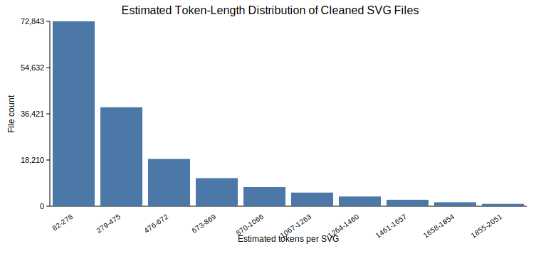
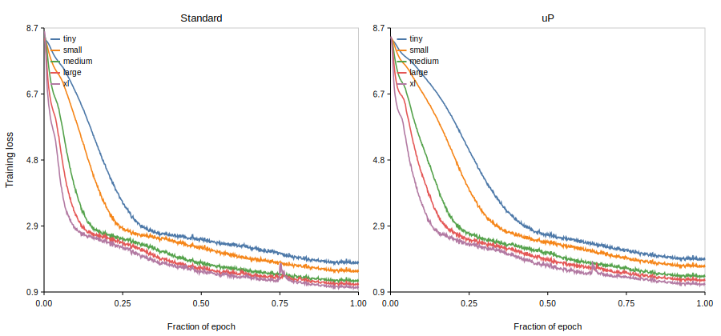
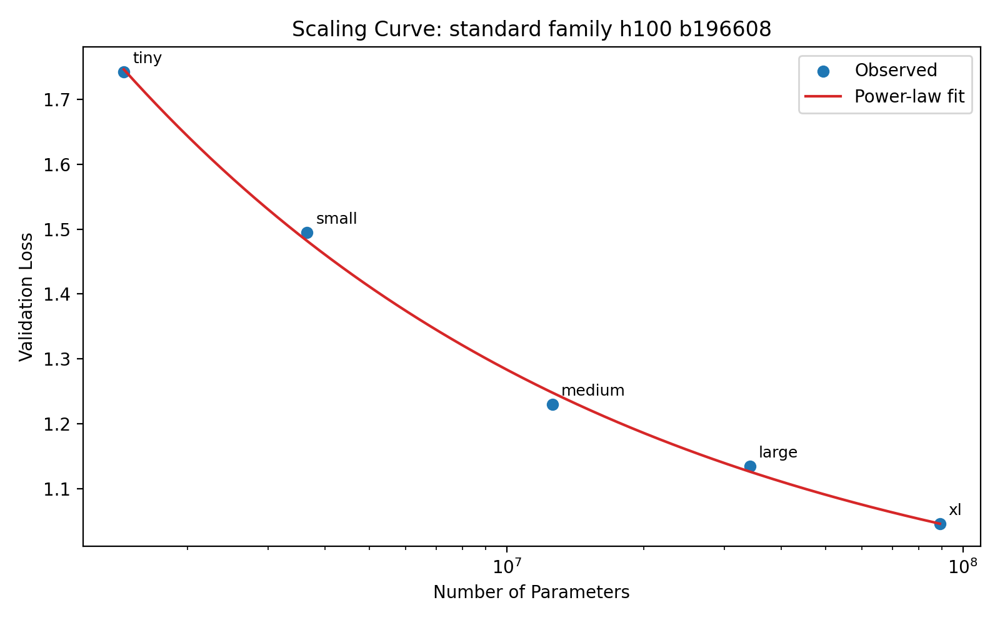
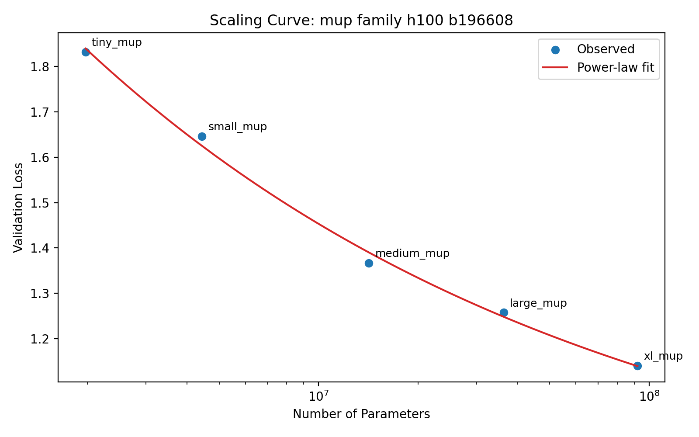
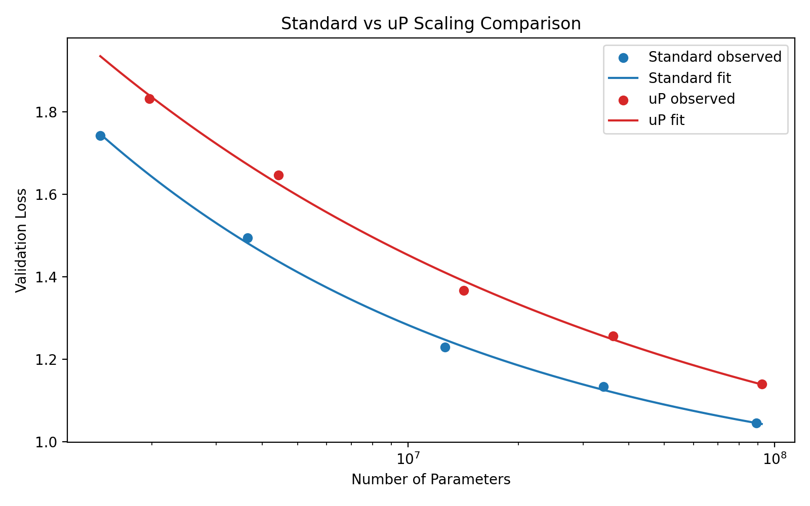

# Scaling Decoder-Only Language Models on SVG: Standard Parameterization and $\mu$P

**Desmond Wang**

**Prof: Pavel Izmailov**
--- ---

## Abstract

This project examines decoder-only transformer language models trained on SVG code and compares standard parameterization with maximal update parameterization ($\mu$P). Because SVG is a text-based vector graphics format, the modeling task can be formulated as next-token prediction over structured XML-like sequences rather than as a vision problem. I built a preprocessing pipeline for SVG normalization and validation, trained a byte-pair tokenizer on the cleaned corpus, and assembled a final training set of $133.5$M tokens from `starvector/svg-icons-simple` and a capped subset of `starvector/svg-fonts-simple`. I then ran exact one-epoch scaling experiments across five model sizes under both standard parameterization and $\mu$P, using a fixed token batch size and a shared learning-rate-transfer protocol within each family. On an H100 GPU, standard parameterization consistently outperformed $\mu$P across the observed range. The fitted scaling exponent was higher for standard ($\alpha = 0.3871$) than for $\mu$P ($\alpha = 0.2757$), and the standard fit also produced a slightly better $10\times$ extrapolated loss ($0.9406$ vs. $0.9647$). Alongside the final scaling study, I also kept brief qualitative notes from earlier exploratory generation checkpoints, which helped diagnose why SVG sampling remained fragile even when likelihood metrics improved. The resulting picture is therefore mixed but clear. SVG scaling behavior is measurable and fits a clean power-law trend, but $\mu$P did not improve learning-rate transfer or scaling quality in this setting.

## 1. Introduction

This assignment asks two specific questions: first, how decoder-only transformer language models scale when they are trained on SVG code, and second, whether maximal update parameterization ($\mu$P) improves learning-rate transfer across model sizes relative to standard parameterization. The motivating intuition is straightforward. SVG files are images, but they are also text: they store vector geometry, attributes, grouping structure, and styling as XML-like strings rather than as raster pixel arrays. That makes them a reasonable domain for language-model training, even though the semantics of the resulting sequences are visual rather than linguistic.

The problem is nevertheless more difficult than ordinary text modeling. An SVG model must learn local syntax, attribute formatting, long numeric fragments, and strict well-formedness constraints at the same time. A generated sequence may look statistically plausible while still failing as an SVG because of one malformed tag or one broken attribute value. For that reason, this project is interesting both as a scaling study and as a test of whether a text-based generative model can handle a formally structured graphics language.

The broader background for the scaling part of the project comes from recent work on neural scaling laws and compute-efficient training (Hoffmann et al., 2022; Kaplan et al., 2020), while the $\mu$P comparison follows the parameter-transfer argument developed by Yang and colleagues (Yang et al., 2022). In this project, I adapt those ideas to the SVG setting by constructing a controlled dataset and tokenizer, training model families under matched protocols, fitting power-law curves, and then examining the generation behavior of the strongest available model.

## 2. Data and Preprocessing

The assignment specified `starvector/svg-icons-simple` as the base dataset and allowed supplementary SVG data if the token target was not met. I first tested the icons dataset alone, then larger mixtures that included `svg-emoji-simple` and `svg-fonts-simple`. The final active corpus used all of `starvector/svg-icons-simple` together with 75,000 streamed rows from `starvector/svg-fonts-simple`. This choice was deliberate rather than maximal. Earlier in the project I tested larger subsets, including 200k font rows, but those configurations overshot the assignment’s scale requirement and increased training cost without improving the quality of the core comparison.

The final cleaned dataset contained 163,341 kept SVG samples, split into 160,074 training files, 1,633 validation files, and 1,634 test files. After tokenization, the training split contained 133,464,477 tokens, comfortably exceeding the 100M-token requirement. The validation and test splits contained 1,345,855 and 1,339,985 tokens respectively.

Each SVG was treated as code rather than as an image to be decoded. The preprocessing pipeline stripped leading and trailing whitespace, removed XML comments, removed `<metadata>...</metadata>` blocks, rounded decimal values to one decimal place, collapsed repeated whitespace, and removed whitespace between adjacent tags. Files were then validated and filtered. A sample was kept only if it parsed as XML, contained an `<svg>` root tag, exceeded the minimum character threshold, and remained under the configured rough token-length threshold during preprocessing. XML validation was ultimately implemented with `lxml`, which aligned the final pipeline with the assignment’s recommended tooling.

These preprocessing choices were not meant to simplify the task artificially. Rather, they were intended to eliminate accidental textual variation that would otherwise inflate the token space. SVGs that are visually similar can still differ in whitespace, numeric precision, metadata, or attribute formatting, and that kind of superficial inconsistency makes tokenization and model training less stable.

Figure 1 shows representative SVG examples from the processed corpus at increasing estimated complexity levels. I present the original SVG renders directly rather than the earlier raster grid artifact, because the rasterized version proved visually misleading for this set of thin black-stroke glyphs.

  
  
  

  
  
  

*Figure 1. Representative SVG examples from the processed dataset, selected across a range of estimated token lengths.*

The cleaned corpus is dominated by relatively short SVGs, but it still retains a meaningful long tail of more complex files. That balance was useful for the project because it kept the token budget large enough for scaling experiments while preserving manageable context lengths for the smaller models.

*Figure 2. Estimated token-length distribution of cleaned SVG files in the final corpus.*

## 3. Tokenization and Model Setup

The tokenizer was trained directly on cleaned SVG text. I used a Hugging Face byte-pair encoding (BPE) tokenizer with a vocabulary size of 4096, which falls within the assignment’s suggested `1K–8K` range. The project initially used `SentencePiece`, but on the larger corpus and under the local execution constraints that path repeatedly failed during tokenizer fitting. Because the assignment explicitly allowed either `SentencePiece` or Hugging Face `tokenizers`, I switched to the latter. This was an implementation change rather than a conceptual one. The model still received tokenized SVG code directly, and the tokenizer still learned common substrings such as XML tags, attribute names, path fragments, and recurring numeric patterns.

All core experiments used decoder-only transformers trained with a standard next-token prediction objective. This is not a vision-recognition setup and not an image-captioning problem. The model reads an SVG token sequence and predicts the next token. I used five model sizes for the scaling study: `tiny`, `small`, `medium`, `large`, and `xl`. Matching `*_mup` variants were used for the $\mu$P experiments.

**Table 1**  
*Transformer configurations used for the standard family*

| Model | Parameters |  d_model | Layers | Heads |  d_ff | Context |
| --- | ---: |---------:| ---: | ---: |------:| ---: |
| tiny | 1,448,704 |      128 | 4 | 4 |   512 | 1024 |
| small | 3,652,608 |      192 | 6 | 6 |   768 | 1024 |
| medium | 12,613,632 |      384 | 6 | 6 |  1536 | 1024 |
| large | 34,146,304 |      512 | 10 | 8 |  2048 | 1024 |
| xl | 88,988,160 |      768 | 12 | 12 |  3072 | 1024 |

Both parameterization regimes used cosine learning-rate decay with warmup. The training logic followed the assignment’s intended design. For each family, I first ran a learning-rate sweep on the smallest model, selected the best learning rate, and then transferred that choice to the larger models in the same family. Standard parameterization and $\mu$P were therefore compared under parallel but independent learning-rate-selection procedures rather than by forcing one family to inherit the other’s LR.

The shared architectural and optimization choices were as follows. All models used context length $1024$, dropout $0.1$, one epoch of training, gradient clipping at $1.0$, and a fixed random seed of $42$. Standard models used AdamW with betas $(0.9, 0.95)$ and weight decay $0.1$, while the $\mu$P family replaced AdamW with MuAdamW and used the corresponding `mup` base and delta shapes required for width transfer. In the final exact H100 study, the training loop overrode the old per-config token batches and used one shared batch size of $196{,}608$ tokens for every model within a family. Validation during the long exact runs was intentionally sparse, because the assignment’s central comparison was loss after one full epoch rather than dense intermediate model selection. The main reported metrics were validation loss after one epoch, fitted scaling-curve parameters, wall-clock time, throughput, peak GPU memory, test-set perplexity for the exploratory generator, XML validity, structural validity, and SVG render success.

## 4. Experimental Protocol and Cloud Execution

The project passed through an exploratory stage and a final reporting stage. The exploratory stage included local preprocessing, short pilot runs, and a small number of longer single-model checkpoints used to test pipeline logic and diagnose generation behavior. Those runs were useful as process checkpoints, but they are not part of the final experimental evidence because they did not share the eventual exact one-epoch protocol, shared batch size, and cloud execution setup used for the final comparison. All quantitative results reported in the next sections come only from the final exact H100 family runs.

The cloud transition mattered because once the exact one-epoch protocol had been implemented correctly, the remaining obstacle was no longer correctness but runtime. The H100 run preserved the methodology while allowing a much larger fixed token batch across the family.

The assignment requires the same batch size in tokens across a compared family, which means that the largest model determines the practical limit. On the H100, I ran `xl` smoke probes at progressively larger token batches. A batch of $131{,}072$ tokens fit comfortably, peaking at about $50.1$ GB of VRAM. A batch of $196{,}608$ tokens also fit and peaked at about $74.9$ GB. I stopped there, because this was already close enough to the $80$ GB ceiling that a larger batch would have traded stability for only a marginal further reduction in optimizer steps. The final shared batch therefore became $196{,}608$ tokens.

This batch-size choice sharply reduced the cost of exact one-epoch training. Under the final H100 setup, one epoch required $679$ optimizer steps rather than the much longer schedules that had made earlier exploratory execution impractical. This was the single most important systems-level optimization in the project, and it remained fully compatible with the assignment because the batch size in tokens stayed fixed within each family.

## 5. Standard-Parameterization Scaling Study

Under the exact H100 protocol, I reran the smallest standard-parameterization learning-rate sweep using five values: $10^{-4}$, $3 \times 10^{-4}$, $5 \times 10^{-4}$, $8 \times 10^{-4}$, and $10^{-3}$. The best learning rate was $10^{-3}$, with a final validation loss of $1.7451$ on the tiny model. This became the shared standard LR for the full family.

**Table 2**  
*Tiny-model standard-parameterization learning-rate sweep on the final H100 protocol*

| Learning Rate | Final Validation Loss |
| ---: | ---: |
| $10^{-4}$ | 3.0507 |
| $3 \times 10^{-4}$ | 2.2513 |
| $5 \times 10^{-4}$ | 1.9848 |
| $8 \times 10^{-4}$ | 1.8190 |
| $10^{-3}$ | 1.7451 |

The full standard family was then trained for exactly one epoch using the same dataset, tokenizer, batch size in tokens, and learning-rate schedule. Table 3 summarizes the results.

**Table 3**  
*One-epoch standard-parameterization family results on H100*

| Model | Parameters | Final Validation Loss |
| --- | ---: | ---: |
| tiny | 1,448,704 | 1.7422 |
| small | 3,652,608 | 1.4950 |
| medium | 12,613,632 | 1.2303 |
| large | 34,146,304 | 1.1344 |
| xl | 88,988,160 | 1.0459 |

The trend is clean and monotonic. Larger models consistently achieved lower validation loss. The entire exact standard family completed in about 11.2 minutes on the H100, which highlights how strongly runtime had depended on hardware rather than on the experimental protocol itself.

The loss trajectories were also stable across the epoch. Figure 3 shows the training curves for all ten final runs, plotted against fraction of the epoch rather than raw step count so that the standard and $\mu$P families can be compared on the same horizontal axis.

*Figure 3. Training curves for all final standard and $\mu$P runs, plotted as training loss against fraction of the epoch.*

I fit the standard family with a power law of the form $L = aN^{-\alpha} + c$, where $L$ is validation loss and $N$ is parameter count. The fit yielded $\alpha = 0.38712$, $R^2 = 0.99827$, and a $10\times$ extrapolated loss of $0.94061$. The corresponding $95\%$ interval was $[0.81907, 1.01327]$. Figure 4 shows the fitted curve.

*Figure 4. Power-law scaling fit for the exact one-epoch standard-parameterization family.*

## 6. $\mu$P Scaling Study

The same exact H100 protocol was then used for the $\mu$P family. The tiny $\mu$P learning-rate sweep tested the same five values as the standard sweep, and again $10^{-3}$ emerged as the best learning rate. Its best tiny-model validation loss was $1.8640$. This learning rate was then transferred to the larger $\mu$P models.

**Table 4**  
*Tiny-model $\mu$P learning-rate sweep on the final H100 protocol*

| Learning Rate | Final Validation Loss |
| ---: | ---: |
| $10^{-4}$ | 4.5435 |
| $3 \times 10^{-4}$ | 2.5413 |
| $5 \times 10^{-4}$ | 2.2416 |
| $8 \times 10^{-4}$ | 1.9685 |
| $10^{-3}$ | 1.8640 |

The full $\mu$P family was trained for exactly one epoch under the same dataset, tokenizer, and shared batch size. Table 5 summarizes the results.

**Table 5**  
*One-epoch $\mu$P family results*

| Model | Parameters | Final Validation Loss |
| --- | ---: | ---: |
| tiny_mup | 1,972,992 | 1.8320 |
| small_mup | 4,439,040 | 1.6464 |
| medium_mup | 14,186,496 | 1.3669 |
| large_mup | 36,243,456 | 1.2573 |
| xl_mup | 92,133,888 | 1.1401 |

The $\mu$P family also scaled in the expected direction: larger models consistently outperformed smaller ones. However, the more interesting question is whether $\mu$P scaled *better* than standard parameterization under the same overall protocol. The fitted $\mu$P power law yielded $\alpha = 0.27570$, $R^2 = 0.99650$, and a $10\times$ extrapolated loss of $0.96469$, with a $95\%$ interval of $[0.67067, 1.19259]$. Figure 5 shows the fitted $\mu$P curve.

*Figure 5. Power-law scaling fit for the one-epoch $\mu$P family.*

## 7. Comparison Between Standard Parameterization and $\mu$P

The comparison is straightforward. At every matched scale, standard parameterization achieved lower validation loss than $\mu$P. The difference is visible even at the largest models, where standard `xl` reached $1.0459$ while `xl_mup` remained at $1.1401$. The fitted curves tell the same story. Standard achieved a larger scaling exponent ($0.38712$ versus $0.27570$) and a slightly better $10\times$ extrapolated loss ($0.94061$ versus $0.96469$).

This was therefore a negative result for $\mu$P, but it is still a useful one. The project does not show that $\mu$P is ineffective in general; it shows that under this particular dataset, architecture family, one-epoch protocol, and SVG language-modeling objective, a tuned standard baseline was stronger in practice. One plausible explanation is that the central difficulty in this task is not only parameter-transfer stability but also learning strict XML well-formedness and high-dimensional local geometry syntax. Another possibility is that one-epoch loss emphasizes early optimization behavior in a way that does not favor $\mu$P here.

Figure 6 overlays the two fitted scaling curves.

*Figure 6. Comparison of the fitted standard-parameterization and $\mu$P scaling curves.*

The assignment also asked for wall-clock time, throughput, and memory usage. Table 6 summarizes those statistics for the exact H100 runs. Two patterns are immediate. First, runtime and throughput scale in the expected direction as the models become larger. Second, standard and $\mu$P remain very close in systems performance, so the main empirical difference between them in this project is in validation loss rather than hardware efficiency.

**Table 6**  
*Training statistics for the exact H100 family runs*

| Run | Elapsed (s) | Tokens/s | Peak GPU MB |
| --- | ---: | ---: | ---: |
| standard tiny | 38.53 | 3,463,523 | 13,048 |
| standard small | 59.29 | 2,250,862 | 17,623 |
| standard medium | 83.91 | 1,590,647 | 25,989 |
| standard large | 160.16 | 833,323 | 46,028 |
| standard xl | 303.89 | 439,190 | 75,570 |
| $\mu$P tiny | 38.89 | 3,431,948 | 13,055 |
| $\mu$P small | 59.81 | 2,231,542 | 17,632 |
| $\mu$P medium | 84.76 | 1,574,586 | 26,006 |
| $\mu$P large | 161.58 | 825,998 | 46,052 |
| $\mu$P xl | 306.19 | 435,886 | 75,608 |

## 8. Extrapolation Study

The assignment asked for an extrapolation study to a model $10\times$ larger than the biggest trained model, together with an uncertainty estimate. This was implemented directly in the scaling-fit scripts. After fitting each curve, I sampled from the fitted covariance estimate and propagated those samples to the $10\times$ model size in order to generate an uncertainty interval.

For standard parameterization, the largest trained model had $88{,}988{,}160$ parameters, and the $10\times$ extrapolated size was $889{,}881{,}600$ parameters. The predicted validation loss at that scale was $0.94061$, with a $95\%$ interval of $[0.81907, 1.01327]$. For $\mu$P, the largest trained model had $92{,}133{,}888$ parameters, and the $10\times$ extrapolated size was $921{,}338{,}880$ parameters. The predicted validation loss at that scale was $0.96469$, with a $95\%$ interval of $[0.67067, 1.19259]$.

The intervals overlap, so these extrapolations should not be read as precise forecasts. Still, the point estimates remain directionally consistent with the observed family results: standard parameterization remains slightly better than $\mu$P.

## 9. Best Model, Perplexity, and Generation

The assignment also required a generation-focused discussion. For that part of the project, I draw on a longer exploratory `xl` checkpoint that was trained earlier in the project to probe generation behavior. This checkpoint was not part of the final exact H100 scaling-family comparison, so I do not use it as quantitative evidence for the scaling claims. I include it only as a qualitative process checkpoint because it exposed the practical failure modes of SVG sampling more clearly than the one-epoch family runs were designed to do.

This exploratory checkpoint nevertheless improved held-out scoring relative to the short pilot runs that preceded it. Its final validation loss was $2.9091$, and its full packed test-set perplexity was $17.7518$. I therefore use it here only to illustrate what the model had and had not learned about SVG structure by that stage of the project.

The saved generation artifacts from this exploratory checkpoint cover the required sample counts when aggregated across the temperature study. Across temperatures `0.5`, `0.8`, and `1.0`, the repository contains 10 unconditional samples and 5 prefix-conditioned samples. Qualitatively, however, the results remained weak. XML-valid rate, structural-valid rate, and render-success rate all remained at `0%`.

**Table 7**  
*Generation and validity metrics across the saved sampling settings*

| Setting                            | Samples | XML-valid | Structural-valid | Render-success |
|------------------------------------| ---: | ---: | ---: | ---: |
| Unconditional, $t = 0.5$           | 4 | 0/4 | 0/4 | 0/4 |
| Unconditional, $t = 0.8$           | 3 | 0/3 | 0/3 | 0/3 |
| Unconditional, $t = 1.0$           | 3 | 0/3 | 0/3 | 0/3 |
| Prefix-conditioned, $t = 0.5$      | 2 | 0/2 | 0/2 | 0/2 |
| Prefix-conditioned, $t = 0.8$      | 2 | 0/2 | 0/2 | 0/2 |
| Prefix-conditioned, $t = 1.0$      | 1 | 0/1 | 0/1 | 0/1 |
| Forced-structure rescue, $t = 0.8$ | 6 | 6/6 | 6/6 | 2/6 |

The prefix-conditioned runs also answer the assignment’s question about completion quality. In principle, the partial prompts should have encouraged contextually appropriate continuation, such as closing shapes or extending local symmetry. In practice, the completions preserved some nearby SVG-like syntax but did not produce semantically appropriate closures. The model treated the prefix more as a local text continuation problem than as a graphical completion problem.

The failure mode is nevertheless informative. Unconditional samples often failed immediately because they did not begin with a proper `<svg ...>` opening sequence. Prefix-conditioned samples sometimes looked more promising locally, but still broke on malformed attribute syntax or invalid structural continuations. In other words, the model learned enough token-level regularity to improve perplexity substantially, but not enough global structure to behave as a reliable SVG generator.

Because no generated SVGs were renderable under the original sampling setup, image grids would mostly display placeholder “invalid SVG” boxes and would add little information to the report. A more useful presentation is to show the raw failure modes directly. Table 8 summarizes representative outputs, the exact parser failures, and the most plausible interpretation of what the model learned.

**Table 8**  
*Representative generation failure modes from the saved evaluation artifacts*

| Setting                               | Raw excerpt from model output | Exact parser / validator failure | Interpretation |
|---------------------------------------| --- | --- | --- |
| Unconditional sample ($t = 0.5$)      | <code>.6 L13.3.7.9.3" stroke="0" stroke-opacity="1" stroke-opacity="0" stroke-width="1" ...</code> | `xml_parse_error: Start tag expected, '<' not found` | The model produced text that resembles path and attribute fragments, but it never established a valid XML document root. This suggests it learned local SVG-like substrings without learning document-level structure. |
| Prefix-conditioned sample ($t = 0.5$) | <code>&lt;svg ...&gt;&lt;path ... d="M11.2 C8 L7.2 L13.4 L13.6 L6 L11.1" stroke-width="none" stroke-width="0" stroke-width="0" ...</code> | `xml_parse_error: AttValue: ' expected` | The model continued from a valid SVG prefix and preserved some local SVG syntax, but it corrupted attribute structure by repeating and deforming attribute fields. This indicates partial local continuation ability without robust quote balancing or attribute grammar. |
| Prefix-conditioned sample ($t = 0.8$) | <code>&lt;svg ...&gt; ... malformed attribute sequence near column 197 ...</code> | `xml_parse_error: attributes construct error` | When sampling became less conservative, the model drifted earlier into malformed attribute construction. The increased temperature worsened structural stability even when the prefix itself was valid. |

Taken together, these outputs suggest that the model learned a recognizable “SVG-like” local token distribution but not the global XML constraints needed for valid and renderable files.

I also ran one additional rescue experiment to probe this limitation more directly. In that experiment, I did not retrain the model. Instead, I forced the decoded output into a strict SVG shell by wrapping the generated text inside a fixed `<svg>` document and sanitizing it into a candidate `path d="..."` payload. This is not a replacement for the main generation protocol, nor is it part of the final scaling evaluation; rather, it is a diagnostic test of what happens if document-level structure is imposed externally after generation.

The result was revealing. Under this forced-structure procedure, all six generated samples became valid XML, and all six passed the structural checks, but only two of the six actually rendered successfully. In other words, the intervention solved the outer-document problem but did not reliably solve the inner geometry problem. The remaining failures moved from “this is not even an SVG document” to “this is an SVG document whose path payload is still semantically malformed.” This distinction matters because it shows that the model’s weakness is layered: first at the XML-shell level, then at the path-geometry level.

Figure 7 compares one real dataset SVG with one forced-structure sample from the model. The contrast is useful precisely because the forced sample is authentic rather than hand-corrected. It passed XML validation and the renderer did not crash, but the visual content is still blank or degenerate. This suggests that the intervention repaired outer document structure more effectively than inner geometric meaning.

  
  

*Figure 7. Left: a valid SVG example from the processed dataset. Right: an authentic forced-structure sample from the model. The forced sample passes XML validation and reaches the rendering stage, but its visual content remains degenerate.*

For completeness, Figure 8 shows the six outputs from the forced-structure diagnostic as a compact rendered grid. This is not the main sampling protocol reported for the assignment, but it is a useful visual summary of what the rescue attempt actually produced: a small number of pipeline-acceptable outputs and several blank or degenerate ones.

  
  
  

  
  
  

*Figure 8. Grid of the six forced-structure diagnostic samples. All six are valid XML under the imposed shell, but only a minority survive rendering without degenerating visually.*

I interpret this rescue experiment as evidence that the original design was permissive in a way that made SVG failure especially likely at generation time. At the same time, the fact that only two of six forced samples rendered also shows that the deeper issue is not solved by outer structure alone. A more principled structured decoder, or a training setup more explicitly aligned with grammar-preserving generation, would likely be needed to make renderable SVG generation reliable.

## 10. Discussion

Several broader lessons emerged from the project. First, the representation issue matters. SVG is text, but it is not ordinary prose. The sequences are inflated by XML structure, repeated coordinates, and geometry-heavy substrings, which means that preprocessing and tokenization matter more than they would for a simpler corpus. This is also one place where the project differs from the natural-language scaling literature. The fitted exponents reported by Kaplan et al. (2020) and the compute-optimal framing discussed by Hoffmann et al. (2022) arise from far more linguistically regular domains and much larger compute budgets. Here, the observed scaling curves are still clean, but they reflect a structured code domain in which syntactic validity and geometric semantics matter simultaneously. Second, systems constraints shaped the project almost as much as the modeling choices did. The exploratory runs were useful because they exposed bottlenecks and failure modes early, but they also showed that the final exact protocol would be difficult to execute at full scale without moving to stronger hardware. The cloud H100 stage made it possible to keep the assignment’s intended one-epoch design without shrinking the family itself.

Third, the core experimental result is clear enough to be informative. In this setting, $\mu$P did not improve learning-rate transfer or scaling quality over standard parameterization. The gap is already visible at the tiny-model sweep stage, where standard reaches $1.7451$ and $\mu$P reaches $1.8640$, and it remains present through the largest models. By the time the comparison reaches `large` and `xl`, the difference is no longer just noise in the fit; it is also visible directly in the final validation losses. A large part of empirical research consists of careful negative results, and this project provides one: the technique that seemed theoretically promising did not help on this SVG language-modeling task under the tested conditions.

Finally, the generation results underscore a familiar but important point. Lower perplexity is not identical to practical generation quality when the target domain has strict formal structure. SVG generation requires not only local token plausibility but also global XML consistency, valid attributes, and renderable geometry. The exploratory generator improved the first of those substantially and still failed the others. That pattern suggests that the models learned basic syntax and many recurring substrings at smaller and intermediate scales, but never crossed into a regime where document-level correctness and spatial coherence became reliable.

## 11. Limitations

This report has several limitations that should be stated directly. The extrapolation study is based on only five observed points per family. Although the fits are strong, any $10\times$ prediction should still be treated cautiously. More broadly, the project emphasized protocol consistency over broad hyperparameter exploration. Better-performing recipes for SVG generation may exist, but exploring them thoroughly would have weakened the controlled-comparison structure of the assignment. The forced-structure generation experiment likewise should be read as a diagnostic intervention rather than as the main reported sampling protocol.

There is also a more conceptual limitation. The models are clearly strong enough in the narrow language-modeling sense to support the core claims of the project: loss decreases smoothly with scale, held-out perplexity improves, and the fitted scaling curves are stable enough for comparison and extrapolation. However, that success does not automatically transfer to practical SVG generation. SVG generation imposes stricter requirements than next-token likelihood alone, because a usable sample must satisfy XML well-formedness, valid attribute syntax, and coherent geometric content simultaneously. In this project, the models learned enough local structure to produce meaningful scaling results, but not enough global and geometric structure to function as reliable generators. This means the project’s scaling conclusions are credible even though its generation results remain weak, but it also means that good predictive metrics should not be overinterpreted as evidence of downstream SVG usability.

## 12. Conclusion

This project built a full SVG language-modeling pipeline from preprocessing through exact scaling-law analysis. The final corpus exceeded $133$M training tokens, the tokenizer was trained directly on cleaned SVG code, and exact one-epoch scaling studies were completed for both standard parameterization and $\mu$P on a cloud H100 GPU. The main conclusion is straightforward: in this setting, standard parameterization outperformed $\mu$P. It achieved lower validation losses across the observed family, a larger fitted scaling exponent, and a better $10\times$ extrapolated loss. The scaling curves were clean and internally consistent, so the negative result for $\mu$P is not anecdotal.

At the same time, the exploratory generation checkpoint substantially improved held-out likelihood without producing valid or renderable SVG samples under the original sampling setup. The final picture is therefore mixed but coherent. SVG scaling behavior for decoder-only transformers is measurable and follows a clear power-law trend, but reliable SVG generation remains substantially harder than loss reduction alone would suggest.

## References

Hoffmann, J., Borgeaud, S., Mensch, A., Buchatskaya, E., Cai, T., Rutherford, E., de Las Casas, D., Hendricks, L. A., Welbl, J., Clark, A., Hennigan, T., & others. (2022). *Training compute-optimal large language models*. arXiv. https://arxiv.org/abs/2203.15556

Jain, A., Mildenhall, B., Barron, J. T., Abbeel, P., & Poole, B. (2023). *VectorFusion: Text-to-SVG by abstracting pixel-based diffusion models*. arXiv. https://arxiv.org/abs/2211.11319

Kaplan, J., McCandlish, S., Henighan, T., Brown, T. B., Chess, B., Child, R., Gray, S., Radford, A., Wu, J., & Amodei, D. (2020). *Scaling laws for neural language models*. arXiv. https://arxiv.org/abs/2001.08361

Karpathy, A. (n.d.). *nanoGPT*. GitHub. https://github.com/karpathy/nanoGPT

Microsoft. (n.d.). *mup*. GitHub. https://github.com/microsoft/mup

PyTorch. (n.d.). *PyTorch*. https://pytorch.org

Rodriguez, J. D., et al. (2023). *StarVector: Generating scalable vector graphics code from images and text*. arXiv. https://arxiv.org/abs/2312.11556

The CairoSVG Project. (n.d.). *CairoSVG*. https://cairosvg.org

The lxml Project. (n.d.). *lxml*. https://lxml.de

UniSVG. (2025). *A unified dataset for vector graphic understanding and generation*. arXiv. https://arxiv.org/abs/2508.07766

Xing, et al. (2025). *Empowering LLMs to understand and generate complex vector graphics*. arXiv. https://arxiv.org/abs/2412.11102

Yang, G., et al. (2022). *Tensor programs V: Tuning large neural networks via zero-shot hyperparameter transfer*. arXiv. https://arxiv.org/abs/2203.09789

## Appendix

### Exact H100 Standard Family

| Model | Parameters | Final Validation Loss |
| --- | ---: | ---: |
| tiny | 1,448,704 | 1.7422 |
| small | 3,652,608 | 1.4950 |
| medium | 12,613,632 | 1.2303 |
| large | 34,146,304 | 1.1344 |
| xl | 88,988,160 | 1.0459 |

### Exact H100 $\mu$P Family

| Model | Parameters | Final Validation Loss |
| --- | ---: | ---: |
| tiny_mup | 1,972,992 | 1.8320 |
| small_mup | 4,439,040 | 1.6464 |
| medium_mup | 14,186,496 | 1.3669 |
| large_mup | 36,243,456 | 1.2573 |
| xl_mup | 92,133,888 | 1.1401 |

### Fitted Scaling Summaries

| Family | $\alpha$ | $R^2$ | $10\times$ Extrapolated Loss |
| --- | ---: | ---: | ---: |
| Standard | 0.38712 | 0.99827 | 0.94061 |
| $\mu$P | 0.27570 | 0.99650 | 0.96469 |
